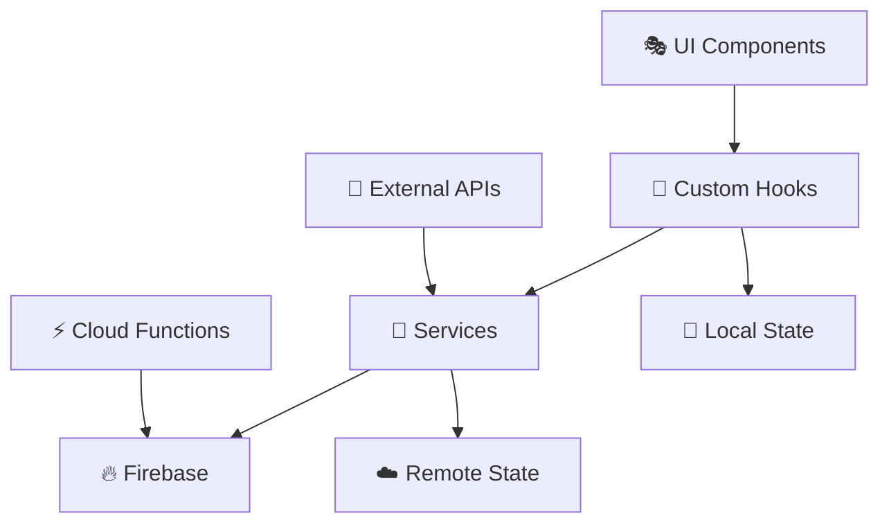

# 🏗️ Architecture SafePass - Documentation Technique

## 📋 Vue d'Ensemble

SafePass est une application Expo 52 utilisant TypeScript, Firebase et des services de vérification d'identité avancés.

### 🛠️ Technologies Principales

- **Frontend** : Expo 52, React Native, TypeScript
- **Backend** : Firebase (Auth, Firestore, Storage, Functions)
- **CI/CD** : GitHub Actions, EAS Build
- **Services** : Google Cloud Document AI, Stripe Payment
- **Tests** : Jest, React Native Testing Library

---

## 📁 Structure du Projet

```
safe-pass-repo/
├── 📱 app/                          # Pages et navigation (Expo Router)
│   ├── (auth)/                      # Écrans d'authentification
│   ├── (tabs)/                      # Écrans principaux avec navigation
│   └── screens/                     # Écrans spécialisés
├── 🧩 components/                   # Composants réutilisables
│   ├── auth/                        # Composants d'authentification
│   ├── basic/                       # Composants de base (Text, Theme)
│   ├── design/                      # Composants UI (Modal, Lists)
│   ├── event/                       # Composants d'événements
│   ├── identity/                    # Composants de vérification
│   ├── payment/                     # Composants de paiement
│   └── ticket/                      # Composants de tickets
├── 🔧 services/                     # Services métier
├── 🎣 hooks/                        # Hooks React personnalisés
├── 🏷️ types/                        # Définitions TypeScript
├── 🛠️ utils/                        # Utilitaires et helpers
├── 🎨 styles/                       # Styles spécialisés
├── 📦 assets/                       # Images, fonts, icônes
├── ⚙️ constants/                    # Constantes (couleurs, configs)
├── 🔥 firebase/                     # Configuration Firebase
├── 🔥 functions/                    # Cloud Functions
├── 🤖 android/                      # Configuration Android native
├── 📋 .github/workflows/            # CI/CD GitHub Actions
└── 📚 docs/                         # Documentation (NOUVEAU)
```

---

## 🏛️ Architecture en Couches

### 🎯 Couche Présentation (UI)

- **Location** : `app/`, `components/`
- **Responsabilité** : Interface utilisateur, navigation, interaction
- **Technologies** : Expo Router, React Native Components

### 🎣 Couche Logique Métier (Hooks)

- **Location** : `hooks/`
- **Responsabilité** : État applicatif, logique métier réutilisable
- **Pattern** : Custom Hooks React

### 🔧 Couche Services

- **Location** : `services/`
- **Responsabilité** : Communication API, logique métier complexe
- **Pattern** : Service Layer Pattern

### 💾 Couche Données

- **Location** : `firebase/`, `types/`
- **Responsabilité** : Persistance, modèles de données
- **Technologies** : Firebase, TypeScript

---

## 🔄 Flux de Données



### 🔗 Intégrations Principales

1. **Firebase Auth** → Authentification utilisateur
2. **Firestore** → Base de données temps réel
3. **Storage** → Stockage fichiers (documents, selfies)
4. **Functions** → Logique serveur (analyse documents, nettoyage)
5. **Google Cloud Document AI** → OCR et validation MRZ
6. **Stripe** → Paiements sécurisés

---

## 🛡️ Sécurité et Conformité

### 🔐 Authentification

- Firebase Auth avec phone verification
- Stockage sécurisé des tokens (SecureStore)
- Sessions persistantes

### 🛡️ Autorisation

- Rules Firebase (Firestore + Storage)
- Vérification côté serveur dans les Functions
- Principe du moindre privilège

### 🏥 Protection des Données

- Chiffrement des données sensibles
- Nettoyage automatique des fichiers temporaires
- Respect du RGPD (right to be forgotten)

### 📋 Validation

- Validation MRZ avec checksums
- Détection de falsification de documents
- Vérification biométrique optionnelle

---

## 🚀 CI/CD et Déploiement

### 🔄 Pipeline Automatisé

1. **Lint & Format** : ESLint, Prettier
2. **Tests** : Jest, React Native Testing Library
3. **Build** : EAS Build pour Android/iOS
4. **Deploy** : Firebase Functions/Hosting automatique

### 🌍 Environnements

- **Development** : `.env.development`
- **Staging** : `.env.staging`
- **Production** : `.env.production`

### 📊 Monitoring

- Firebase Analytics
- Crashlytics pour les erreurs
- Performance monitoring

---

## 📈 Performance et Optimisation

### ⚡ Stratégies d'Optimisation

- **Lazy Loading** : Chargement différé des écrans
- **Caching** : Cache intelligent avec React Query/SWR
- **Images** : Optimisation et compression automatique
- **Bundle** : Tree-shaking et code splitting

### 📊 Métriques Cibles

- **Temps de démarrage** : < 3 secondes
- **Taille de l'app** : < 50MB
- **Utilisation mémoire** : < 100MB
- **Taux de succès** : > 95%

---

## 🔧 Outils de Développement

### 🛠️ IDE et Extensions

- VS Code avec extensions Expo/React Native
- TypeScript strict mode
- Auto-formatting avec Prettier

### 🧪 Testing

- **Unit Tests** : Jest
- **Integration Tests** : React Native Testing Library
- **E2E Tests** : Detox (à implémenter)

### 📝 Documentation

- JSDoc pour le code
- Markdown pour la documentation utilisateur
- Schémas Mermaid pour l'architecture

---

## 🚨 Gestion des Erreurs

### 🎯 Stratégie d'Error Handling

1. **Try/Catch** dans tous les services
2. **Error Boundaries** React pour l'UI
3. **Logging** centralisé avec Firebase
4. **Retry Logic** pour les opérations critiques

### 📊 Monitoring et Alertes

- Crashlytics pour les crashes
- Custom events pour le business logic
- Alertes en temps réel pour les erreurs critiques

---

## 🔮 Roadmap Technique

### 🎯 Version Actuelle (v1.0)

- ✅ Authentification complète
- ✅ Vérification d'identité (OCR + MRZ)
- ✅ Gestion d'événements
- ✅ Système de tickets
- ✅ CI/CD automatisé

### 🚀 Prochaines Versions

#### v1.1 - Améliorations UX

- [ ] Mode hors-ligne
- [ ] Push notifications
- [ ] Partage de tickets

#### v1.2 - Fonctionnalités Avancées

- [ ] QR codes dynamiques
- [ ] Analytics avancées
- [ ] Multi-langues

#### v1.3 - Entreprise

- [ ] API publique
- [ ] Webhook system
- [ ] White-labeling

---

## 📞 Support et Maintenance

### 🆘 Contacts Techniques

- **Lead Developer** : [À définir]
- **DevOps** : [À définir]
- **Support** : support@safepass.com

### 📅 Processus de Release

1. **Feature branch** → Development
2. **Pull Request** avec review
3. **Staging deployment** pour tests
4. **Production deployment** après validation

---

_📅 Dernière mise à jour : Décembre 2024_
_🔄 Version du document : 1.0_
