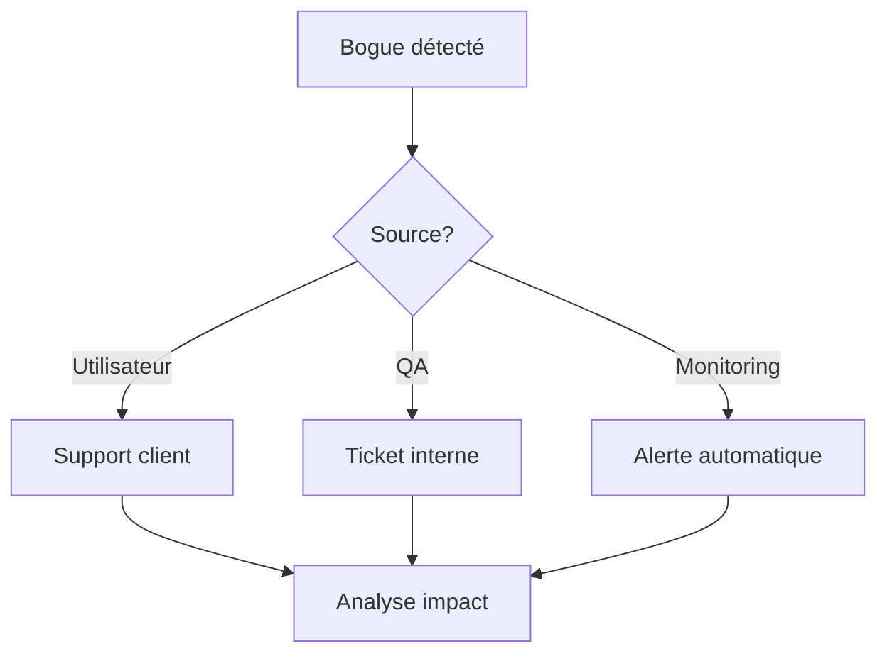

# 🐛 Plan de Correction des Bogues - SafePass

## 🎯 Méthodologie de Gestion des Bogues

### Classification des Bogues

#### 🔴 Critique (P0)

- **Impact** : Bloque l'utilisation de l'application
- **Exemples** : Crash au démarrage, impossible de se connecter, paiements échouent
- **SLA** : Correction immédiate (< 4h)
- **Processus** : Hotfix en urgence

#### 🟠 Majeur (P1)

- **Impact** : Fonctionnalité principale impactée
- **Exemples** : Notifications non reçues, interface dégradée
- **SLA** : Correction sous 24h
- **Processus** : Patch dans la prochaine release

#### 🟡 Moyen (P2)

- **Impact** : Fonctionnalité secondaire impactée
- **Exemples** : Problème d'affichage mineur, lenteur ponctuelle
- **SLA** : Correction sous 1 semaine
- **Processus** : Intégration dans le sprint suivant

#### 🟢 Mineur (P3)

- **Impact** : Amélioration ou optimisation
- **Exemples** : Suggestion UX, petite optimisation
- **SLA** : Correction sous 1 mois
- **Processus** : Backlog produit

---

## 📋 Workflow de Correction

### 1. Détection du Bogue



### 2. Évaluation et Priorisation

**Critères d'évaluation** :

- 🎯 **Impact utilisateur** (1-5)
- 📊 **Nombre d'utilisateurs affectés** (1-5)
- 🔧 **Complexité de correction** (1-5)
- 💰 **Impact business** (1-5)

**Formule de priorité** :

```
Priorité = (Impact + Utilisateurs_affectés + Impact_business) - Complexité
```

### 3. Assignment et Suivi

| Rôle              | Responsabilité                  |
| ----------------- | ------------------------------- |
| **Product Owner** | Priorisation et validation      |
| **Tech Lead**     | Assignment technique            |
| **Développeur**   | Implémentation de la correction |
| **QA Engineer**   | Tests de régression             |
| **DevOps**        | Déploiement et monitoring       |

---

## 🔧 Procédures de Correction

### Correction Critique (P0)

```bash
# 1. Création de la branche hotfix
git checkout main
git pull origin main
git checkout -b hotfix/critical-bug-YYYY-MM-DD

# 2. Correction du bogue
# ... développement ...

# 3. Tests d'urgence
npm run test:critical
npm run test:e2e:smoke

# 4. Review express (2 approbations minimum)
git push origin hotfix/critical-bug-YYYY-MM-DD
# Créer PR avec label "HOTFIX"

# 5. Déploiement d'urgence
git checkout main
git merge hotfix/critical-bug-YYYY-MM-DD
git tag v1.x.x-hotfix
git push origin main --tags

# 6. Déploiement
npm run deploy:production:emergency
```

### Correction Standard (P1-P3)

```bash
# 1. Création de la branche depuis develop
git checkout develop
git pull origin develop
git checkout -b fix/bug-description

# 2. Développement de la correction
# ... code ...

# 3. Tests complets
npm run test
npm run test:e2e
npm run lint

# 4. Review normale
git push origin fix/bug-description
# Créer PR vers develop

# 5. Intégration dans le cycle normal
# Merge après review et tests
```

---

## 📊 Templates de Documentation

### Template de Rapport de Bogue

```markdown
## 🐛 Rapport de Bogue

### Informations générales

- **ID** : BUG-YYYY-MM-DD-XXX
- **Priorité** : P0/P1/P2/P3
- **Statut** : Nouveau/En cours/Résolu/Fermé
- **Assigné à** : @username
- **Date de création** : DD/MM/YYYY
- **Version affectée** : v1.x.x

### Description

Décrire le problème en une phrase claire.

### Étapes de reproduction

1. Étape 1
2. Étape 2
3. Étape 3

### Résultat attendu

Ce qui devrait se passer normalement.

### Résultat observé

Ce qui se passe actuellement (avec le bogue).

### Environnement

- **OS** : iOS 15.x / Android 12.x
- **Appareil** : iPhone 13 / Samsung Galaxy S22
- **Version app** : v1.x.x
- **Conditions réseau** : WiFi/4G/3G

### Captures d'écran/Vidéos

[Joindre les fichiers]

### Logs d'erreur
```

[Coller les logs pertinents]

```

### Impact business
- Nombre d'utilisateurs affectés : X
- Perte de revenus estimée : X€
- Impact sur la réputation : Faible/Moyen/Élevé

### Analyse technique
- **Cause racine** : Description technique
- **Modules affectés** : Liste des composants
- **Données affectées** : Types de données impactées

### Solution proposée
Description de la correction envisagée.

### Tests de régression
- [ ] Tests unitaires
- [ ] Tests d'intégration
- [ ] Tests E2E
- [ ] Tests de performance

### Communication
- [ ] Notification équipe dev
- [ ] Information support client
- [ ] Communication utilisateurs (si nécessaire)
```

---

## 🚨 Procédures d'Urgence

### Rollback d'Urgence

```bash
# 1. Identifier la version stable précédente
git tag -l | grep production | tail -5

# 2. Rollback de l'application
git checkout v1.x.x-stable
npm run deploy:production:rollback

# 3. Rollback de la base de données (si nécessaire)
# Exécuter les scripts de rollback préparés

# 4. Communication
# Notifier tous les stakeholders
```

### Communication de Crise

**Template d'email d'urgence** :

```
Objet: [URGENCE] Incident technique SafePass - Action requise

Équipe,

Un incident critique a été détecté sur SafePass :
- Description : [Description courte]
- Impact : [Nombre d'utilisateurs / fonctionnalités]
- Heure de début : [Timestamp]
- Priorité : P0

Actions en cours :
- [ ] Investigation en cours par [Nom]
- [ ] Correction estimée dans [Durée]
- [ ] Communication utilisateurs préparée

Prochaine mise à jour dans 30 minutes.

[Nom du responsable incident]
```

---

## 📈 Métriques et KPIs

### Indicateurs de Qualité

| Métrique                           | Objectif     | Actuel |
| ---------------------------------- | ------------ | ------ |
| **MTTR** (Mean Time To Resolution) | < 4h pour P0 | -      |
| **Taux de régression**             | < 2%         | -      |
| **Couverture de tests**            | > 80%        | -      |
| **Temps de déploiement**           | < 30min      | -      |
| **Disponibilité**                  | > 99.9%      | -      |

### Tableau de Bord

```javascript
// Exemple de métriques à suivre
{
  "bugs_ouverts": {
    "P0": 0,
    "P1": 2,
    "P2": 8,
    "P3": 15
  },
  "temps_resolution_moyen": {
    "P0": "2h",
    "P1": "18h",
    "P2": "4j",
    "P3": "2sem"
  },
  "taux_satisfaction_correction": "94%",
  "couverture_tests": "87%"
}
```

---

## 🔄 Processus d'Amélioration Continue

### Retrospective Mensuelle

**Questions clés** :

1. Quels types de bogues reviennent souvent ?
2. Comment améliorer notre détection précoce ?
3. Les processus de correction sont-ils efficaces ?
4. Y a-t-il des formations nécessaires ?

### Actions d'Amélioration

- **Automatisation** : Scripts de détection et correction
- **Formation** : Sessions techniques équipe
- **Outils** : Amélioration de la chaîne CI/CD
- **Processus** : Optimisation des workflows

### Documentation des Leçons Apprises

Créer une base de connaissances avec :

- Historique des incidents majeurs
- Solutions appliquées
- Préventions mises en place
- Best practices développées

---

## 📞 Contacts d'Urgence

### Escalade Technique

1. **Développeur assigné** : Premier contact
2. **Tech Lead** : Escalade niveau 2
3. **Architecte** : Problèmes structurels
4. **CTO** : Décisions stratégiques

### Escalade Business

1. **Product Owner** : Impact produit
2. **Product Manager** : Décisions produit
3. **COO** : Impact opérationnel
4. **CEO** : Communication externe

### Contacts Externes

- **Hébergeur** : Support infrastructure
- **Stripe** : Support paiements
- **Firebase** : Support services Google
- **App Stores** : Support publication
