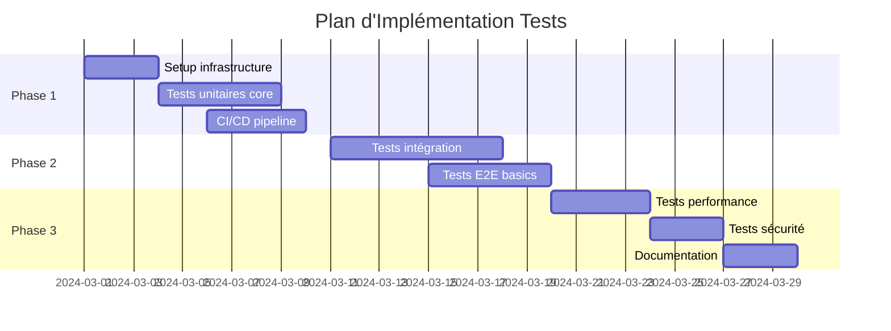

# 🧪 Plan d'Implémentation des Tests - SafePass

## 🎯 Roadmap des Tests

### Phase 1 : Foundation (Semaines 1-2)



---

## 🔧 Configuration Technique

### Structure des Tests

```
tests/
├── unit/                 # Tests unitaires
│   ├── components/
│   ├── services/
│   ├── utils/
│   └── hooks/
├── integration/          # Tests d'intégration
│   ├── api/
│   ├── database/
│   └── external-services/
├── e2e/                  # Tests end-to-end
│   ├── auth/
│   ├── events/
│   ├── payments/
│   └── user-journeys/
├── performance/          # Tests de performance
│   ├── load-testing/
│   └── stress-testing/
├── security/            # Tests de sécurité
│   ├── penetration/
│   └── vulnerability/
└── fixtures/            # Données de test
    ├── users.json
    ├── events.json
    └── payments.json
```

### Configuration Jest Avancée

```javascript
// jest.config.advanced.js
module.exports = {
  projects: [
    {
      displayName: 'unit',
      testMatch: ['<rootDir>/tests/unit/**/*.test.{js,ts,tsx}'],
      setupFilesAfterEnv: ['<rootDir>/tests/setup/unit.setup.js'],
    },
    {
      displayName: 'integration',
      testMatch: ['<rootDir>/tests/integration/**/*.test.{js,ts,tsx}'],
      setupFilesAfterEnv: ['<rootDir>/tests/setup/integration.setup.js'],
    },
    {
      displayName: 'e2e',
      testMatch: ['<rootDir>/tests/e2e/**/*.test.{js,ts,tsx}'],
      setupFilesAfterEnv: ['<rootDir>/tests/setup/e2e.setup.js'],
      testTimeout: 30000,
    },
  ],
  collectCoverageFrom: ['src/**/*.{js,ts,tsx}', '!src/**/*.d.ts', '!src/test/**'],
  coverageThreshold: {
    global: {
      branches: 80,
      functions: 80,
      lines: 80,
      statements: 80,
    },
    './src/services/auth/': {
      branches: 95,
      functions: 95,
      lines: 95,
      statements: 95,
    },
  },
};
```

---

## 📝 Templates de Tests

### Template Test Unitaire

```typescript
// Template: tests/unit/template.test.ts
import { render, fireEvent, waitFor } from '@testing-library/react-native';
import { Component } from '../../../src/components/Component';

describe('Component', () => {
  // Setup
  beforeEach(() => {
    jest.clearAllMocks();
  });

  // Test principal
  it('should render correctly', () => {
    const { getByText } = render(<Component />);
    expect(getByText('Expected Text')).toBeTruthy();
  });

  // Test d'interaction
  it('should handle user interaction', async () => {
    const mockCallback = jest.fn();
    const { getByTestId } = render(<Component onPress={mockCallback} />);

    fireEvent.press(getByTestId('button'));

    await waitFor(() => {
      expect(mockCallback).toHaveBeenCalledTimes(1);
    });
  });

  // Test d'erreur
  it('should handle error state', () => {
    const { getByText } = render(<Component hasError={true} />);
    expect(getByText('Error message')).toBeTruthy();
  });
});
```

### Template Test E2E

```typescript
// Template: tests/e2e/user-journey.test.ts
import { device, element, by, expect as detoxExpect } from 'detox';

describe('User Journey: Complete Purchase', () => {
  beforeAll(async () => {
    await device.launchApp();
  });

  beforeEach(async () => {
    await device.reloadReactNative();
  });

  it('should complete full purchase flow', async () => {
    // Login
    await element(by.id('login-phone')).typeText('0123456789');
    await element(by.id('login-password')).typeText('password123');
    await element(by.id('login-button')).tap();

    // Navigate to events
    await element(by.id('events-tab')).tap();
    await detoxExpected(element(by.id('events-list'))).toBeVisible();

    // Select event
    await element(by.id('event-item-1')).tap();
    await element(by.id('buy-tickets-button')).tap();

    // Purchase
    await element(by.id('quantity-input')).typeText('2');
    await element(by.id('add-to-cart-button')).tap();
    await element(by.id('checkout-button')).tap();

    // Verify success
    await detoxExpected(element(by.text('Purchase Successful'))).toBeVisible();
  });
});
```

---

## 🎯 Tests par Module

### Tests Authentification

```typescript
// tests/integration/auth.test.ts
describe('Authentication Flow', () => {
  describe('Registration', () => {
    it('should register new user successfully', async () => {
      const userData = {
        email: 'test@example.com',
        phone: '+33123456789',
        password: 'SecurePassword123!',
        firstName: 'John',
        lastName: 'Doe',
      };

      const result = await authService.register(userData);

      expect(result.success).toBe(true);
      expect(result.user.email).toBe(userData.email);
      expect(result.verification.sent).toBe(true);
    });

    it('should handle duplicate email error', async () => {
      const userData = {
        email: 'existing@example.com',
        phone: '+33123456789',
        password: 'SecurePassword123!',
      };

      await expect(authService.register(userData)).rejects.toThrow('Email already exists');
    });
  });

  describe('Login', () => {
    it('should login with valid credentials', async () => {
      const credentials = {
        phone: '+33123456789',
        password: 'SecurePassword123!',
      };

      const result = await authService.login(credentials);

      expect(result.success).toBe(true);
      expect(result.token).toBeDefined();
      expect(result.user).toBeDefined();
    });

    it('should handle invalid credentials', async () => {
      const credentials = {
        phone: '+33123456789',
        password: 'WrongPassword',
      };

      await expect(authService.login(credentials)).rejects.toThrow('Invalid credentials');
    });
  });
});
```

### Tests Paiements

```typescript
// tests/integration/payments.test.ts
describe('Payment Processing', () => {
  beforeEach(() => {
    // Setup Stripe test environment
    stripe.setPublishableKey('pk_test_...');
  });

  it('should process payment successfully', async () => {
    const paymentData = {
      amount: 5000, // 50€
      currency: 'eur',
      paymentMethod: 'pm_card_visa',
      eventId: 'event-123',
      tickets: [{ type: 'standard', quantity: 2 }],
    };

    const result = await paymentService.processPayment(paymentData);

    expect(result.status).toBe('succeeded');
    expect(result.tickets).toHaveLength(2);
    expect(result.confirmation.sent).toBe(true);
  });

  it('should handle payment failure', async () => {
    const paymentData = {
      amount: 5000,
      currency: 'eur',
      paymentMethod: 'pm_card_declined',
      eventId: 'event-123',
    };

    await expect(paymentService.processPayment(paymentData)).rejects.toThrow('Payment declined');
  });

  it('should handle insufficient funds', async () => {
    const paymentData = {
      amount: 5000,
      currency: 'eur',
      paymentMethod: 'pm_card_insufficient_funds',
      eventId: 'event-123',
    };

    const result = await paymentService.processPayment(paymentData);

    expect(result.status).toBe('failed');
    expect(result.error.code).toBe('insufficient_funds');
  });
});
```

### Tests Performance

```typescript
// tests/performance/load.test.ts
describe('Performance Tests', () => {
  it('should handle concurrent user logins', async () => {
    const concurrentUsers = 100;
    const promises = [];

    for (let i = 0; i < concurrentUsers; i++) {
      promises.push(
        authService.login({
          phone: `+3312345678${i.toString().padStart(2, '0')}`,
          password: 'TestPassword123!',
        })
      );
    }

    const startTime = Date.now();
    const results = await Promise.allSettled(promises);
    const endTime = Date.now();

    const successfulLogins = results.filter(r => r.status === 'fulfilled').length;
    const avgResponseTime = (endTime - startTime) / concurrentUsers;

    expect(successfulLogins).toBeGreaterThanOrEqual(95); // 95% success rate
    expect(avgResponseTime).toBeLessThan(2000); // < 2s average
  });

  it('should maintain performance under load', async () => {
    const requests = Array.from({ length: 1000 }, (_, i) =>
      eventService.getEvents({ page: Math.floor(i / 20) })
    );

    const startTime = performance.now();
    await Promise.all(requests);
    const endTime = performance.now();

    const totalTime = endTime - startTime;
    const avgResponseTime = totalTime / requests.length;

    expect(avgResponseTime).toBeLessThan(500); // < 500ms average
  });
});
```

---

## 🔒 Tests de Sécurité

### Tests Vulnérabilités

```typescript
// tests/security/vulnerabilities.test.ts
describe('Security Vulnerabilities', () => {
  it('should prevent SQL injection', async () => {
    const maliciousInput = "'; DROP TABLE users; --";

    await expect(userService.searchUsers(maliciousInput)).not.toThrow();

    // Verify database integrity
    const usersCount = await userService.getUserCount();
    expect(usersCount).toBeGreaterThan(0);
  });

  it('should prevent XSS attacks', async () => {
    const maliciousScript = '<script>alert("XSS")</script>';
    const user = await userService.updateProfile({
      firstName: maliciousScript,
    });

    expect(user.firstName).not.toContain('<script>');
    expect(user.firstName).toBe('&lt;script&gt;alert("XSS")&lt;/script&gt;');
  });

  it('should enforce rate limiting', async () => {
    const requests = Array.from({ length: 100 }, () =>
      authService.login({
        phone: '+33123456789',
        password: 'wrong-password',
      })
    );

    const results = await Promise.allSettled(requests);
    const rateLimitedRequests = results.filter(
      r => r.status === 'rejected' && r.reason.message.includes('Rate limit exceeded')
    );

    expect(rateLimitedRequests.length).toBeGreaterThan(0);
  });
});
```

---

## 📊 Outils et Configuration

### Package.json Scripts

```json
{
  "scripts": {
    "test": "jest",
    "test:unit": "jest --selectProjects unit",
    "test:integration": "jest --selectProjects integration",
    "test:e2e": "detox test",
    "test:performance": "jest tests/performance",
    "test:security": "jest tests/security",
    "test:watch": "jest --watch",
    "test:coverage": "jest --coverage",
    "test:ci": "jest --coverage --watchAll=false --passWithNoTests",
    "test:smoke": "jest tests/smoke --verbose",
    "test:regression": "jest tests/regression --verbose"
  }
}
```

### Configuration Detox E2E

```json
// .detoxrc.json
{
  "testRunner": "jest",
  "runnerConfig": "tests/e2e/config.json",
  "configurations": {
    "ios.sim.debug": {
      "binaryPath": "ios/build/Build/Products/Debug-iphonesimulator/SafePass.app",
      "build": "xcodebuild -workspace ios/SafePass.xcworkspace -scheme SafePass -configuration Debug -sdk iphonesimulator -derivedDataPath ios/build",
      "type": "ios.simulator",
      "device": {
        "type": "iPhone 15"
      }
    },
    "android.emu.debug": {
      "binaryPath": "android/app/build/outputs/apk/debug/app-debug.apk",
      "build": "cd android && ./gradlew assembleDebug assembleAndroidTest -DtestBuildType=debug",
      "type": "android.emulator",
      "device": {
        "avdName": "Pixel_4_API_30"
      }
    }
  }
}
```

---

## 🚀 Intégration CI/CD

### GitHub Actions Workflow

```yaml
# .github/workflows/test-full-suite.yml
name: Full Test Suite

on:
  pull_request:
    branches: [main, develop]
  push:
    branches: [main]

jobs:
  unit-tests:
    runs-on: ubuntu-latest
    steps:
      - uses: actions/checkout@v4
      - uses: actions/setup-node@v4
        with:
          node-version: '18'
          cache: 'npm'
      - run: npm ci
      - run: npm run test:unit
      - run: npm run test:coverage

  integration-tests:
    runs-on: ubuntu-latest
    needs: unit-tests
    steps:
      - uses: actions/checkout@v4
      - uses: actions/setup-node@v4
        with:
          node-version: '18'
          cache: 'npm'
      - run: npm ci
      - run: npm run test:integration

  e2e-tests:
    runs-on: ubuntu-latest
    needs: [unit-tests, integration-tests]
    steps:
      - uses: actions/checkout@v4
      - uses: actions/setup-node@v4
        with:
          node-version: '18'
          cache: 'npm'
      - run: npm ci
      - run: npm run test:e2e

  security-tests:
    runs-on: ubuntu-latest
    steps:
      - uses: actions/checkout@v4
      - uses: actions/setup-node@v4
        with:
          node-version: '18'
          cache: 'npm'
      - run: npm ci
      - run: npm run test:security
      - run: npm audit --audit-level=high
```

Ce cahier de recettes complet vous donne une base solide pour implémenter une stratégie de tests robuste pour SafePass. Voulez-vous que je continue avec des sections spécifiques ou que j'approfondisse certains aspects ?
